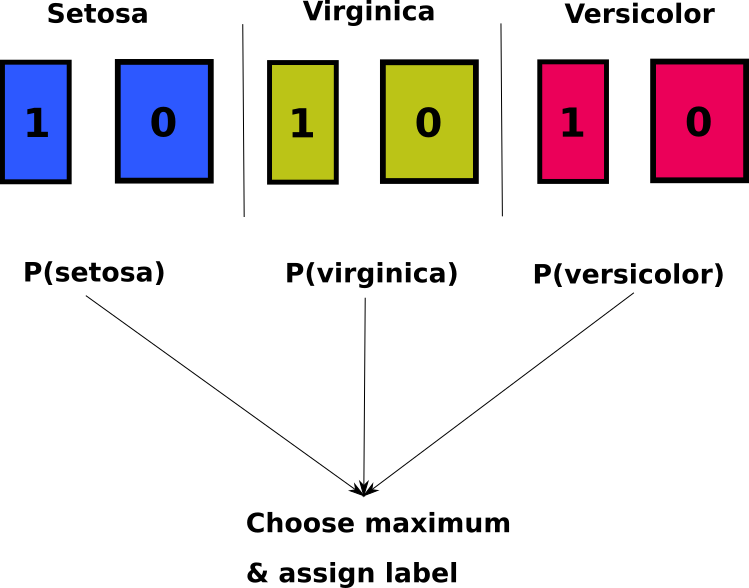
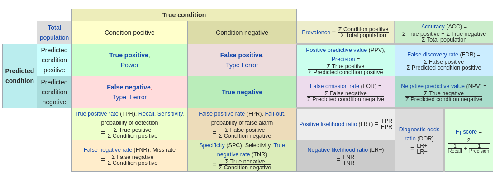

Start by loading the `iris` dataset. You can go through the code much as you would in a regular R script.

```{r}
## Load the iris data
rm(list=ls())
data("iris")

# Look at data
summary(iris)
```

## Part I: complete linear separation

We will start with a very naive approach. Without looking at the data, we try to predict whether the species is Setosa or not. 

```{r}
# Naively, we simply model setosa or not? (1/0) without exploring the data
iris[,5] <- ifelse(iris[,5] == "setosa", 1, 0)

# Run glm model
binmodel <- glm(Species ~ ., data=iris, family=binomial(link="logit"))
```

**Q. What does the warning message mean?**

(Hint: look at the summary of the model. What do you notice?)

```{r}
summary(binmodel)
```

Let's plot the data

```{r}
# Let's look at the data
data("iris")
plot(iris[,1:4], col=iris[,5])
```

**Q. What do we conclude about this data?**

<!-- Clearly, the Setosa group is very well separated from the other data on at least three of the four variables. -->

To further understand the problem of perfect separation, lets look at the data in a scatterplot. We cannot plot four dimensions, but perhaps three dimensions is enough?

```{r}
library(plotly)
library(ggplot2)
p <- plot_ly(iris, x = ~Sepal.Length, y = ~Petal.Length, z = ~Petal.Width, 
             color = ~Species, colors = c('red', 'blue', 'green')) %>%
  add_markers() %>%
  layout(scene = list(xaxis = list(title = 'Sepal length'),
                      yaxis = list(title = 'Petal length'),
                      zaxis = list(title = 'Petal width')))
plotly_build(p)
```

Another possibility is to compute the principal components of the data and to plot the first two components.

```{r}
prc <- princomp(iris[,1:4])
prc <- prc$scores

# Make a new dataset
prcdata <- data.frame("component1" = prc[,1],
                      "component2" = prc[,2],
                      "species" = iris[,5])

ggplot(prcdata, aes(x=component1, y=component2, color=species)) +
  geom_point() + 
  theme_bw() 
```

**Q. for which research question is perfect separation an issue? Is it an issue if we want to make inferences or if we want to predict?**

(Hint: try to separate the algorithm from statistical theory. Which one is impacted by perfect separation of variables?)

## Part II: Multinomial logistic regression & making inferences

```{r}
library(rattle.data)
library(nnet)
data("wine")
## Run a model
multimodel <- multinom(Type ~ Alcohol + Alcalinity + Hue + Color + Flavanoids, data=wine,
                       Hess = TRUE,
                       model = TRUE)
## View the summary of the model
summary(multimodel)
```

**Q. How should we interpret the model? What is missing from the output?**

In the multinomial logistic regression output, we compare the coefficients, standard errors, p-values etc. with reference to a 'base category' (much like we do with dummy variables > 2 categories). 

So, for this model, we have:

$$
\ln\left(\frac{P(type = 2)}{P(type = 1)}\right) = \beta_0 + \beta_1(Alcohol) + \beta_2(Alcalinity) + \beta_3(Hue) + \beta_4(Color) + \beta_5(Flavanoids) + \epsilon \\
\\
\ln\left(\frac{P(type = 3)}{P(type = 1)}\right) = \beta_0 + \beta_1(Alcohol) + \beta_2(Alcalinity) + \beta_3(Hue) + \beta_4(Color) + \beta_5(Flavanoids) + \epsilon 
$$

Interpreting the odds ratios is the same as with binary logistic regression

```{r}
exp(coef(multimodel))
```

**Q. How should you interpret the coefficients? What are the most important predictors in the model?**

**Q. Do you notice anything odd?**

The output does not give us p-values, but we can perform a trick to get them

```{r}
zvals <- summary(multimodel)$coefficients / summary(multimodel)$standard.errors
pnorm(abs(zvals), lower.tail=FALSE)*2
```

**Q. Interpret the statistical significance of the coefficients. How should we do this?**

```{r}
## Get the model confusion table
pred <- predict(multimodel, wine[,c(2,5,12,11,8)])
caret::confusionMatrix(pred, wine[,1])
```

For model fit, we'll examine McFadden's pseudo $R^2$ 

```{r}
# Deviance of the model v. deviance of null model
deviance(multimodel) / deviance(update(multimodel, . ~ 1, trace=FALSE))
```

**Q. How do you interpret the model fit? Are there any caveats?**

## Part III: Multinomial logistic regression for classification

We will be using a 'naive' model on the `iris` dataset we used above:

  - model all three classes separately (as binaries). So we are running K models for K classes.
  - we then compare the probabilities for each model and choose the 'most likely' one
    e.g. the class which has the highest probability.
    
```{r}

```

**Q. What is the research question?**

**Q. What do we want from the classifier? i.e. what are we trying to optimize**

```{r}
 # FROM: https://en.wikipedia.org/wiki/Sensitivity_and_specificity
```

The outcomes should look 'likely' given the data. So a point that has the label $1$ but has a low probability of being selected as such gets penalized by the log-likelihood. As an aside, the use of the log function is a computational choice: by the rules of logarithms, products can be summed instead of multiplied when we take the log.

Now we perform multi-class classification. First, think about what a 'naive' model would do given K classes? Would it:

  - guess randomly?
  - choose the class with the maximum number of subjects?
  - ....

First, we run the classifier and retrieve the probabilities for each class
  
```{r}
## Load the mnlr library
library(mnlr)
mclr <- mlogistic(iris[,1:4], iris[, 5])
# View probabilities
probs <- as.data.frame(mclr$probabilities)
head(probs)
```

Lets see what the probabilities look like for each class

```{r}
# Reshape data from wide --> long format
library(reshape2)
probs_long <- melt(probs)

# Plot densities
ggplot(probs_long, aes(x=value, fill=variable)) +
  geom_density(alpha=1) +
  theme_bw() +
  facet_grid(variable ~ .) +
  theme(legend.position = "none") +
  scale_x_continuous(name = "probability")
```

**Q. What do you learn from this plot?**

```{r}
# Inspect confusion matrix
pred_classes <- mclr$predictions
caret::confusionMatrix(as.factor(pred_classes), iris[,5])
```

**Q. What does the confusion matrix tell us?**

**Q. Based on the above plots, would you say this is a good result?**

**Q. How do we know this model will work well for future data?**

### Cross validation

Now let's stop for a moment and think about what we've done here. What might be the problem with our current approach?

We're overfitting, but we have no idea how to tackle this issue because we have no 'unbiased' data to test how much we're overfitting.

So pretend that we're at the beginning of our classification quest, and this time we're using some basic cross-validation.

```{r}

```

```{r}
rm(list=ls())
data("iris")

## We split the data into train/test
set.seed(8)
index <- runif(nrow(iris))

## We split the data such that approximately 80% is used for training, 10% is used for testing our trained model, and another 10% is used for testing the final model
train <- which(index <= 0.70)
dev <- which(index > 0.7 & index <= 0.85)
test <- which(index > 0.85)

## Subset data
iris_train <- iris[train,]
iris_dev <- iris[dev,]
iris_test <- iris[test,]
```

To illustrate the use of cross-validation, we'll add some random noise to the dev and test data. 

```{r}
set.seed(100)
iris_dev[,1:4] <- apply(iris_dev[,1:4], 2, function(x) x + runif(length(x), 0, 0.5))
set.seed(500)
iris_test[,1:4] <- apply(iris_test[,1:4], 2, function(x) x + runif(length(x), 0, 0.5))
```

**Q. What effect does adding random error to the dev/test sets have?**

(Hint: think about the bias-variance trade-off)

We train a new model and observe what happens when we try to predict on the train and the development sets.

```{r}
mclr2 <- mlogistic(iris_train[,1:4], iris_train[, 5])

## Predict class
preds <- predict_mlr(mclr2, iris_train[,1:4])
caret::confusionMatrix(as.factor(preds$class), iris_train[, 5])
```

```{r}
## Predict class on dev set
preds_dev <- predict_mlr(mclr2, iris_dev[,1:4])
caret::confusionMatrix(as.factor(preds_dev$class), iris_dev[, 5])
```

**Q. What happened to the accuracy of the model? Why is the model underperforming so much on unbiased data?**

(Hint: think about the bias-variance trade-off. What did we do to the dev & test set?)

(Also: think about the number of data points we have.)

### Regularization

The algorithm for logistic regression tries to minimize a *cost function*. In this case (1)

$$
\tag{1}
\mathcal{J}(w,b) = -\frac{1}{m} \sum_{i=0}^n \mathcal{L}(\hat{y}, y) 
$$

Where the log-likelihood $\mathcal{L}$ is given by

$$
\tag{2}
\mathcal{L}(\hat{y}, y) = y \log(\hat{y}) + (1-y) \log(1-\hat{y}) \\
$$

We implement regularization by adding a penalty to the cost function

$$
\tag{3}
\mathcal{J}(w,b) = -\frac{1}{m} \sum_{i=0}^n \mathcal{L}(\hat{y}, y) + \frac{\lambda}{2m}||w||^2_2 
$$

We minimize the cost function hrough successive iterations of the algorithm, much like the Newton-Rhapson algorithm. By increasing the regularization parameter $\lambda$, we 'increase' the minimum cost for the function and add more bias to the model.

```{r, echo=FALSE}
# Create some ys
x <- seq(-5,5,0.01)
y <- 3*x^2 + 2*x -2
y2 <- 3*x^2 + 2*x +20
y3 <- 3*x^2 + 2*x +40

df <- data.frame(x=x, y1=y, y2=y2, y3=y3)
df <- reshape2::melt(df, 1)
library(ggplot2)
ggplot(df, aes(x=x, y=value, color=variable)) +
  geom_line(size=2) +
  scale_color_discrete(labels = c("no lambda", "lambda = 10", "lambda = 20"),
                       name = "Lambda") +
  theme_bw() +
  theme(axis.text = element_blank(),
        axis.ticks = element_blank(),
        axis.line = element_blank(),
        axis.title = element_blank(),
        legend.text = element_text(size=15),
        legend.title = element_text(size=18))
```

Let's see what happens when we train a bunch of models with different lambda values.

```{r}
## What happens to the cost function with different values of lambda?
grid <- c(0.1, 1, 5, 10, 30, 50, 100)
result <- list()
for(value in grid) {
  
  ## Train model with lambda value
  mod <- mlogistic(iris_train[,1:4], iris_train[, 5], lambda = value)
  
  ## Retrieve costs
  costs <- lapply(mod$models, function(x) x$model_information$costs)
  
  ## Bind into a matrix
  costs_matrix <- do.call(cbind, costs)
  
  ## Calculate mean cost as an approximation
  avg_cost <- apply(costs_matrix, 1, mean)
  
  ## Save results to list
  result[[paste0("lambda", value)]] <- avg_cost
  
}

## Bind the columns together
result_bind <- do.call(cbind, result)
## Reshape the data from wide --> long format
library(reshape2)
result_bind_long <- melt(result_bind)
## Add iteration numbers
result_bind_long$iteration <- rep(1:2000, length(grid))

## Plot
library(ggplot2)
ggplot(result_bind_long, aes(x=iteration, y=value, color=Var2)) +
  geom_line() +
  theme_bw() +
  theme(legend.title = element_text("Lambda")) +
  scale_x_continuous(name = "Iteration") +
  scale_y_continuous(name = "Cost")
```

**Q. What do we see on this plot? The x-axis contains the iterations of the algorithm and the y-axis is the cost function.**

We train a new model with a high lambda value and see if this creates a better fit on the data

```{r}
mclr3 <- mlogistic(iris_train[,1:4], iris_train[, 5], lambda = 100)

## Predict class on train data
preds <- predict_mlr(mclr3, iris_train[,1:4])
caret::confusionMatrix(as.factor(preds$class), iris_train[, 5])
```

Predict on the development set

```{r}
## Predict on dev set
preds_dev <- predict_mlr(mclr3, iris_dev[,1:4])
caret::confusionMatrix(as.factor(preds_dev$class), iris_dev[, 5])
```

```{r}
# Predict on test set
preds_test <- predict_mlr(mclr3, iris_test[,1:4])
caret::confusionMatrix(as.factor(preds_test$class), iris_test[, 5])
```

**Q. Is this a better fit? Why/why not?**

```{r}
print(mclr2$models$setosa$model_information$params) # Model without lambda
print(mclr3$models$setosa$model_information$params) # Model with lambda
```

**Q. What does this do to interpretability if the coefficients? What happened to them? The coefficients are assumed to be unbiased population parameters. Given the effect of the l2-regularization on the coefficients, can this still be the case?**

**Q. When do you think that regularization is a good technique? In what sort of situations would you use it?**

**Q. Given the dimensions of this data, do you think we would achieve the above result often? In other words, is there a high chance that the train/dev/test split was representative for the data or did we draw a good result by chance?**
